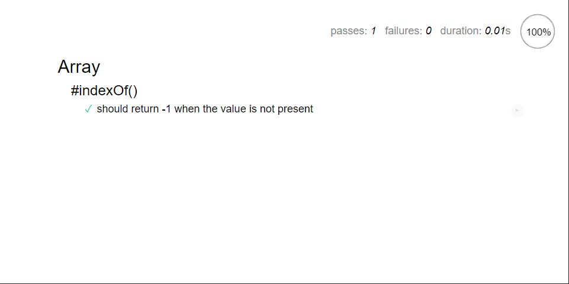
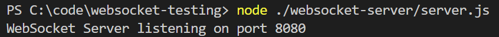

# Exercising various Mocha, Chai, and Sinon Features to test WebSockets
Mostly these are experiments in understanding how [WebSockets](https://developer.mozilla.org/en-US/docs/Web/API/WebSockets_API) can be tested in a browser.
## Dependencies
- [Mocha](https://mochajs.org/) is a test runner
- [Chai](https://www.chaijs.com/) defines Asserition (test validators)
- [Sinon](https://sinonjs.org/) is test Stub/Spy/Mock library
- [Reconnecting-WebSocket](https://github.com/pladaria/reconnecting-websocket#readme) automaticaly reconnects if the WebSocket connection is lost
- [Mock-Socket](https://github.com/thoov/mock-socket) mocks a socket.io server implementation
- [Mock-WebSocket](https://github.com/PhillipRC/mock-websocket) a 'generic' WebSocket server implementation

## Getting Started
- Prerequisits
  - [Git](https://gitforwindows.org/)
  - [NodeJS](https://nodejs.org/)
  - [Chrome](https://www.google.com/chrome)

> `git clone git@github.com:PhillipRC/websocket-testing.git` && `cd ./websocket-testing` && `npm install`

---

# Folders

- `/tests-browser` - Tests that run in a browser
- `/test-cli` - Tests that run in the CLI
- `/websocket-browser-client` - A browser based WebSocket Client app
- `/websocket-node-server` - A Node based WebSocket Server app

---

# Running the Examples

Some of the tests require the WebSocket Server application to be running to be 100% successful

## tests-cli/mocha-chai.spec.js
- Mocha, Chai in CLI
> `npx mocha ./tests-cli/mocha-chai.spec.js`

## tests-browser/mocha-chai.html
- Mocha, Chai in Browser
> `start chrome ./tests-browser/mocha-chai.html`

## /server/server.js
Local Websocket Server in Node
> `node ./websocket-server/server.js`

## tests-browser/mocha-chai-sinon.html
- Mocha, Chai, Sinon in Browser
> `start chrome ./tests-browser/mocha-chai-sinon.html`

## tests-browser/mocha-chai-sinon-mocksocket.html
- Tests running in a Browser
- Mocha, Chai, Sinon
- Mock-Socket mocks a socket.io server implementation
> `start chrome ./tests-browser/mocha-chai-sinon.html`

## tests-browser/mocha-chai-sinon-mocksocket-reconnectingwebsocket.html
- Tests running in a Browser
- Mocha, Chai, Sinon
- Mock-Socket mocks a socket.io server implementation
- Reconnecting-Websocket
> `start chrome ./tests-browser/mocha-chai-sinon-mocksocket-reconnectingwebsocket.html`

## /client
WebSocket Client Application
> `start chrome ./websocket-client/index.html`

## test-browsers/app.html
- Tests running in a Browser
- Mocha, Chai, Sinon
- Mock-WebSocket a 'generic' WebSocket server implementation
> `start chrome ./tests-browser/app.html`
