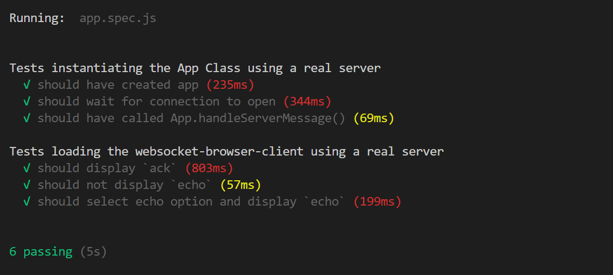

# Exercising various Mocha, Chai, and Sinon Features to test WebSockets
Mostly these are experiments in understanding how [WebSockets](https://developer.mozilla.org/en-US/docs/Web/API/WebSockets_API) can be tested in a browser.
## Dependencies
- [Mocha](https://mochajs.org/) is a test runner
- [Chai](https://www.chaijs.com/) defines Asserition (test validators)
- [Sinon](https://sinonjs.org/) is test Stub/Spy/Mock library
- [Reconnecting-WebSocket](https://github.com/pladaria/reconnecting-websocket#readme) automaticaly reconnects if the WebSocket connection is lost
- [Mock-Socket](https://github.com/thoov/mock-socket) mocks a socket.io server implementation
- [Mock-WebSocket](https://github.com/PhillipRC/mock-websocket) a 'generic' WebSocket server implementation
- [Express](https://github.com/expressjs/express) a Node Webserver
- [Cypress](https://github.com/cypress-io/cypress) a Browser based Test Runner

## Getting Started
- Prerequisits
  - [Git](https://gitforwindows.org/)
  - [NodeJS](https://nodejs.org/)
  - [Chrome](https://www.google.com/chrome)

> `git clone git@github.com:PhillipRC/websocket-testing.git` && `cd ./websocket-testing` && `npm install`

---

# Folders

- `/tests-browser` - Tests that run in a browser
- `/tests-node` - Tests that run in the CLI (Node)
- `/websocket-browser-client` - A browser based WebSocket Client app
- `/websocket-node-server` - A Node based WebSocket Server app

---

# Running the Examples

Some of the tests require the WebSocket Server application to be running to be 100% successful

## /websocket-node-server/[server.js](./websocket-node-server/server.js)
Local Server and Web Server in Node, allows for:
- Serving a WebSocket @ localhost:8080
- Serving project files @ localhost:3000/`filePath`
> `node ./websocket-node-server/server.js`

----

## tests-node/[mocha-chai.spec.js](./tests-node/mocha-chai.spec.js)
- Mocha, Chai in CLI
> `npx mocha ./tests-node/mocha-chai.spec.js`

----

## tests-browser/[mocha-chai.html](./tests-browser/mocha-chai.html)
- Mocha, Chai in Browser
> `start chrome http://localhost:3000/tests-browser/mocha-chai.html`

---

## tests-browser/[mocha-chai-sinon.html](./tests-browser/mocha-chai-sinon.html)
- Mocha, Chai, Sinon in Browser
> `start chrome http://localhost:3000/tests-browser/mocha-chai-sinon.html`

----

## tests-browser/[mocha-chai-sinon-mocksocket-reconnectingwebsocket.html](./tests-browser/mocha-chai-sinon-mocksocket-reconnectingwebsocket.html)
- Tests running in a Browser
- Mocha, Chai, Sinon
- Mock-Socket mocks a socket.io server implementation
- Reconnecting-Websocket
> `start chrome http://localhost:3000/tests-browser/mocha-chai-sinon-mocksocket-reconnectingwebsocket.html`

----

## websocket-browser-client
WebSocket Client Application
Has an option to send an `echo` message and a display for data returned by the `WebSocket.onmessage` event
> `start chrome http://localhost:3000/websocket-browser-client/index.html`

----

## tests-browser/[app.html](./tests-browser/app.html)
Runs two sets of tests one against a real WebSocket server then the same tests against a Mock WebSocket server
- Tests running in a Browser
- Mocha, Chai, Sinon
- Mock-WebSocket a 'generic' WebSocket server implementation
> `start chrome http://localhost:3000/tests-browser/app.html`

----

## cypress/[app.spec.js](./cypress/app.spec.js)
Runs tests against the application in browser within the Cypress framework
> `npx cypress run --spec **/app.spec.js`

